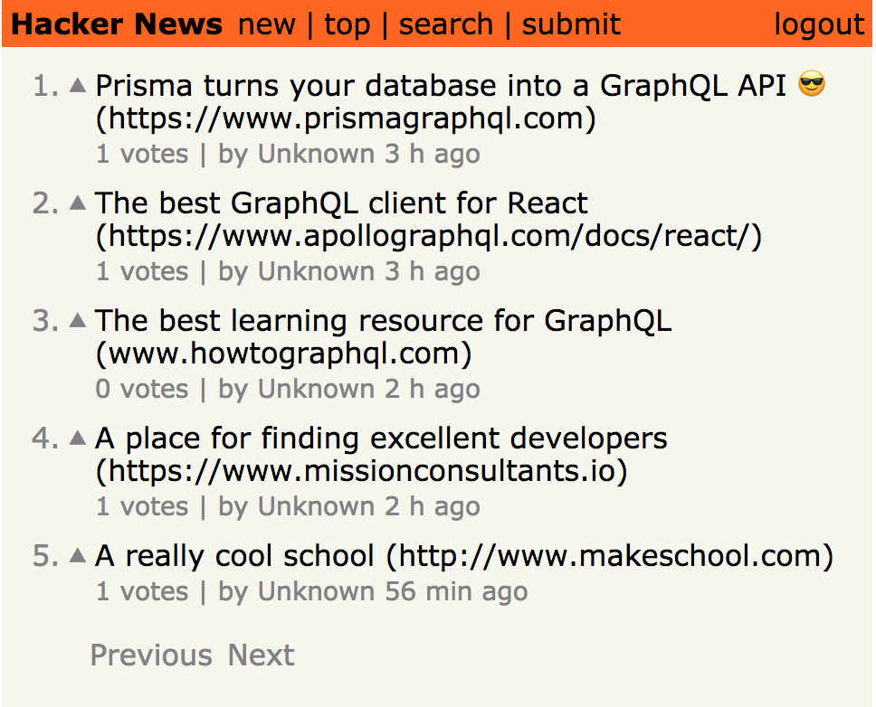

# HackerNews-React-Apollo

This is product is a clone of the popular tech news site [hackernews.com](https://news.ycombinator.com/) using GraphQL, React, the Apollo Client, and Prisma for backend deployment. You can see a [live demo by clicking here](https://hackernews-tassos.herokuapp.com/).  

This product was part of a tutorial created by [Nikolas Burk](https://github.com/nikolasburk) at GraphCool.

You can find the full tutorial yourself [here](https://www.howtographql.com/react-apollo/0-introduction/).

## Features

* Most-recent news feed
* Top sorted by vote score feed
* Search
* Authentication using JWT and GraphQL
* Feeds have pagination
* Voting and scoring
* Users can submit new links

## Setup Locally

1. Navigate to the `server/` folder and run `nodemon` or `npm start`.
2. From the root directory run `yarn install` and `yarn start`.

